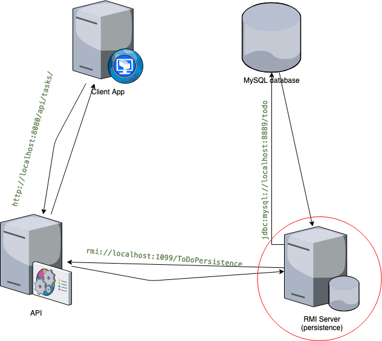

# todoListApp-Persistence
Data tier for a [todo-list app](https://github.com/eoamegassi/todoListApp-client) 
that allows a [Restful Webservice](https://github.com/eoamegassi/todoListApp-API) 
to interact with data stored in a MySQL database via RMI.

